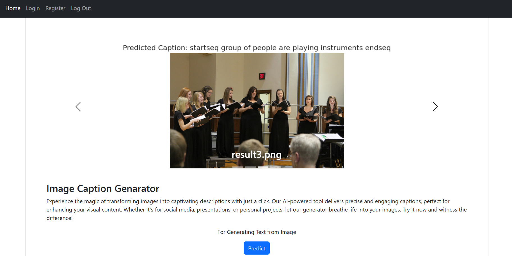
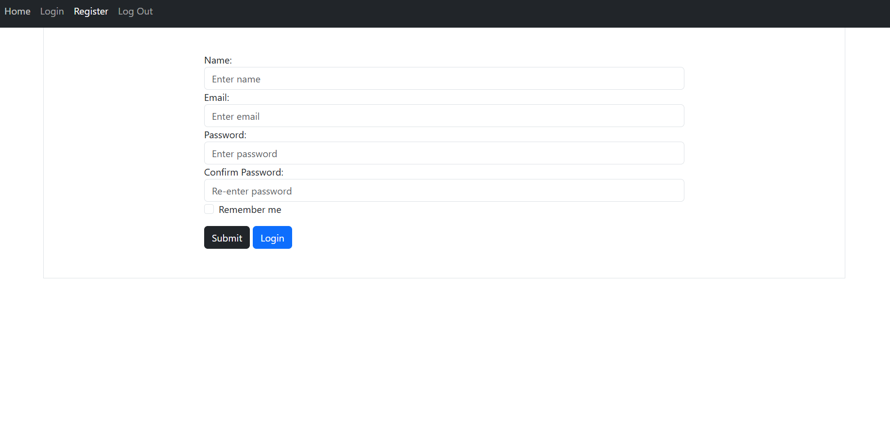
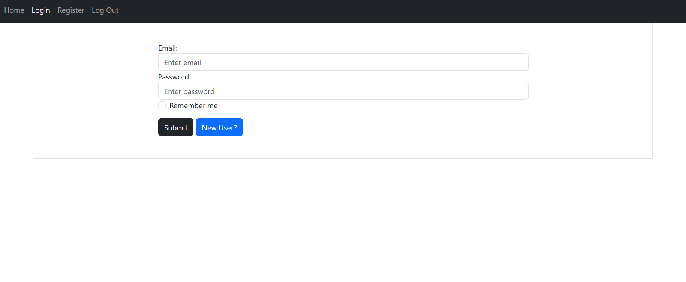
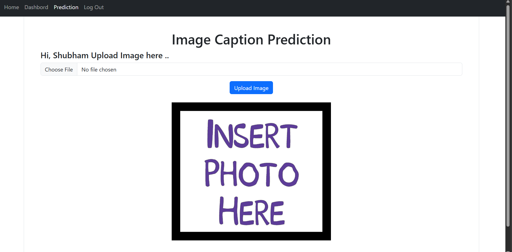
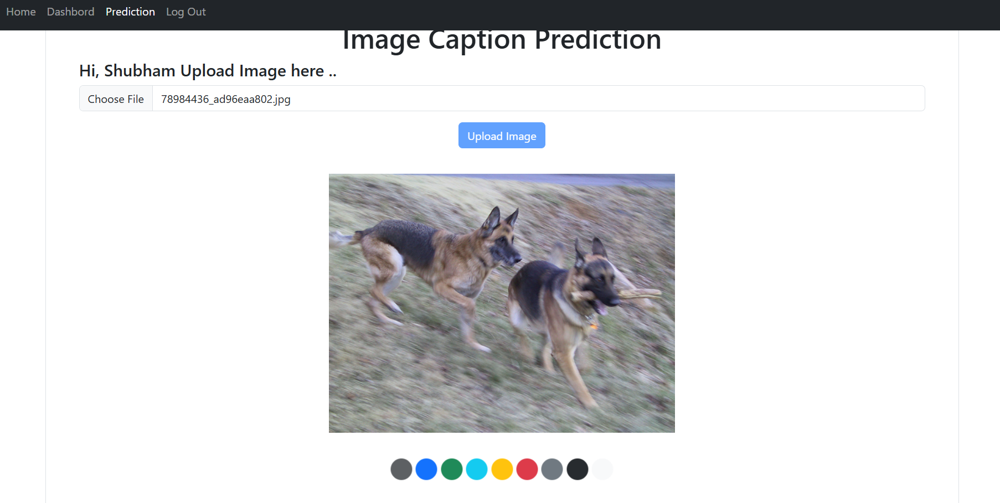
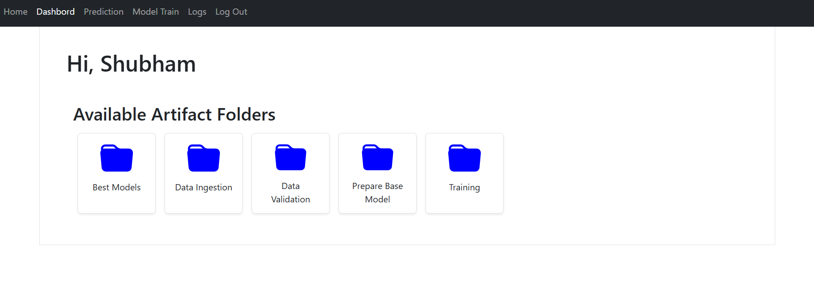
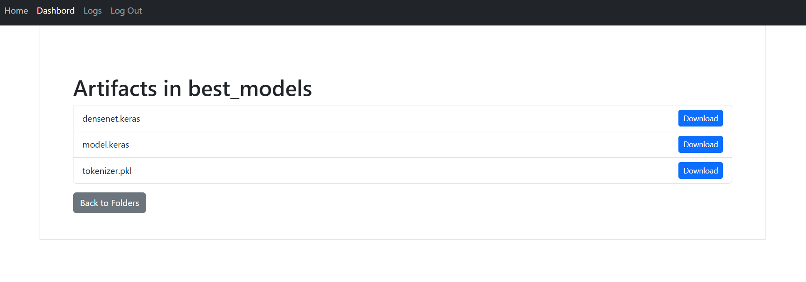
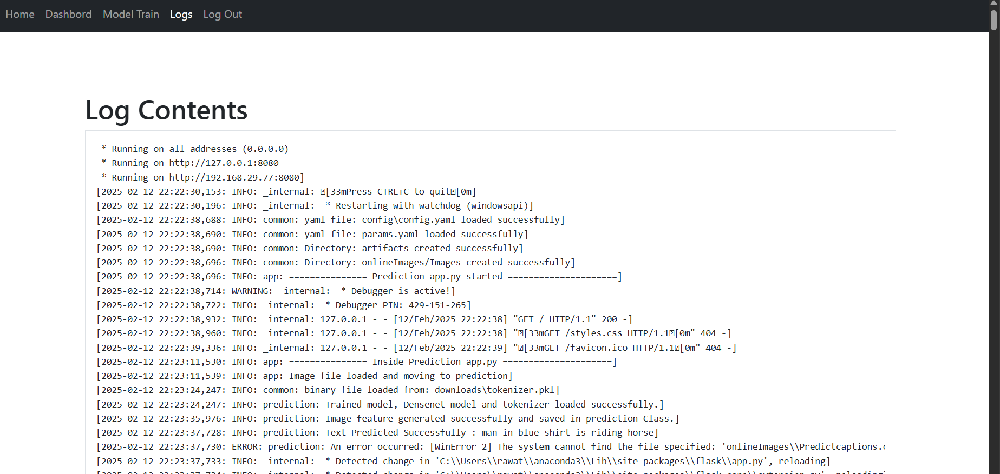
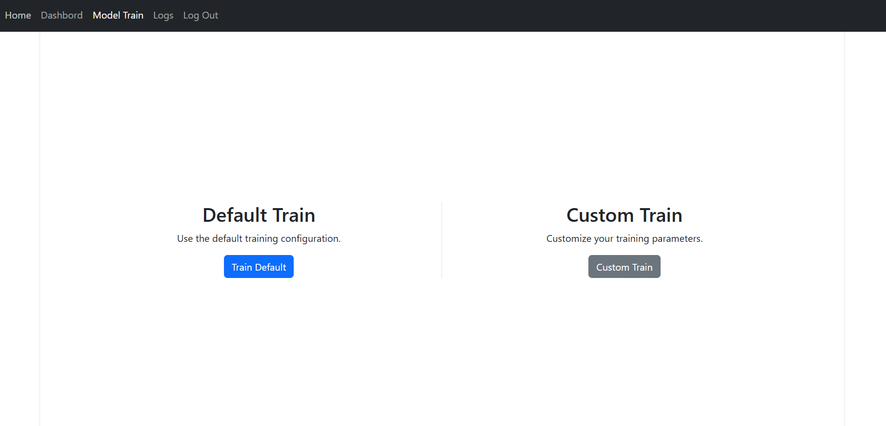
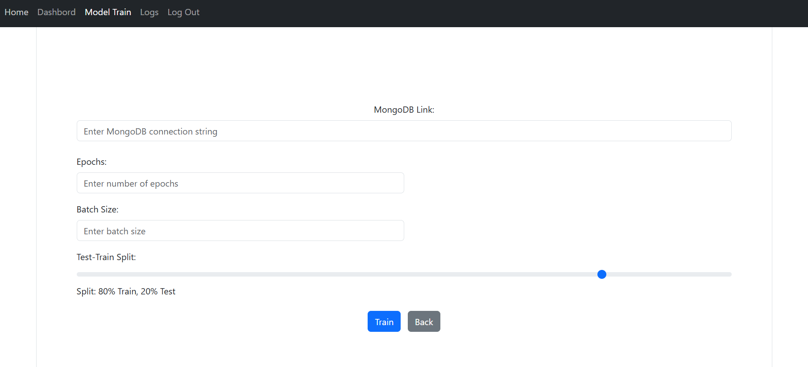

  # Image Caption Generation
  
Image Caption Generation is a fascinating task in the field of computer vision and natural language processing. It involves creating descriptive captions for images using machine learning models. The process typically combines image feature extraction with sequence modeling techniques to generate meaningful and coherent captions.
  
  
# ML-Ops Working Pipeline

This project outlines the steps involved in building, training, testing, and deploying a machine learning model for image captioning. The pipeline includes data ingestion, data validation, model building, model training, model testing, and deployment.

## Table of Contents
1. [Project Overview](#project-overview)
2. [Data Ingestion Pipeline](#data-ingestion-pipeline)
3. [Data Validation Pipeline](#data-validation-pipeline)
4. [Model Building Pipeline](#model-building-pipeline)
5. [Model Training Pipeline](#model-training-pipeline)
6. [Model Tester and Best Model Selector](#model-tester-and-best-model-selector)
7. [Best Model Pusher to S3](#best-model-pusher-to-s3)
8. [Prediction Pipeline](#prediction-pipeline)

## Project Overview

The project involves creating a machine learning pipeline to generate captions for images. The key steps include data ingestion, data validation, model building, model training, testing, and deploying the best model to an S3 bucket.

## Data Ingestion Pipeline

1. **Connect to MongoDB**: Establish a connection to your MongoDB database. Retrieve the image data and corresponding captions stored in the database.
2. **Download Images**: Save the images to your local storage or a cloud storage solution.
3. **Download Captions**: Extract the captions from the MongoDB collection and save them in a CSV file. Ensure each row in the CSV file corresponds to an image and its caption.

## Data Validation Pipeline

1. **Verify Image Integrity**: Check if all images are valid and not corrupted. Ensure each image can be opened and processed without errors.
2. **Validate Captions**: Ensure every image has a corresponding caption in the CSV file. Check for any missing or empty captions.
3. **Split Data**: Divide the data into training and testing sets to evaluate model performance on unseen data.

## Model Building Pipeline

1. **Build DenseNet201 Model**: Load the pre-trained DenseNet201 model. Remove the last two layers to extract features from the images.
2. **Custom Model**: Create a new custom model that takes two inputs: image features extracted from DenseNet201 and text data in sequence. Design this model to integrate the two inputs effectively for caption generation.
3. **Custom Data Generator**: Load image features from DenseNet201. Read text sequences (captions) from the CSV file. Create and shuffle batches of image features and text sequences. Yield batches of image features and text sequences for model training.

## Model Training Pipeline

1. **Feature Extraction from DenseNet**: Extract features from input data using a pre-trained DenseNet model. Perform any necessary preprocessing steps on the extracted features.
2. **Data Generation**: Use a custom data generator to create additional training data. Ensure the data generator is properly configured to produce data in the required format.
3. **Feeding Data to the Model**: Feed the generated data into the machine learning model. Set up data pipelines to ensure smooth data flow during training.
4. **Model Training**: Define the training loop, including loss function, optimizer, and evaluation metrics. Train the model using the generated data. Implement checkpoints to save model states at regular intervals.
5. **Evaluation and Validation**: Validate the trained model on a separate validation dataset. Evaluate model performance using predefined metrics.

## Model Tester and Best Model Selector

1. **Model Evaluation using BLEU Score**: Evaluate the old and new models using the BLEU score on test data. Compare their performance to determine the best model.
2. **Store the Best Model**: Save the best-performing model in a separate artifacts folder. Update and store model parameters in a YAML file.

## Best Model Pusher to S3

1. **Upload Best Model to S3**: Load the best model from the previous pipeline. Configure the S3 bucket for uploading the model. Upload the best model to the S3 bucket for further use.

## Prediction Pipeline

1. **Create Prediction Pipeline**: Initialize the prediction pipeline. Integrate the best model into the prediction pipeline. Configure the prediction pipeline for use in making predictions.


  ## Installation
  
  Clone the Repository and create an environment
  
  ```bash
   pip install -r requirements.txt
   python app.py
  ```
      

## Features

- User Registration

- User Login

- Access to Secure Dashboard

- Display and Download Files from the Artifacts Folder
  


  ## Screenshots
  - Home Page
  

  - New User Registration Page
  

  - Login Page
  

  - Predict Page
  

  - Predict Loading
  

  - Dashboard Page
  

  - Download File page
  

  - Logs Page
  

  - Trainning Page
  

  - Custom Train page
  
  


  ## Authors
  
  - [@Shubham Rawat](https://www.github.com/rawatshubham09)
  
  ## License
  [](https://choosealicense.com/licenses/mit/)
  [MIT](https://choosealicense.com/licenses/mit/)
  
  
